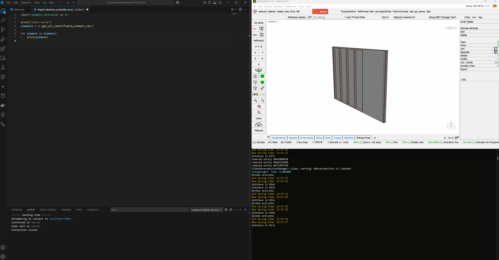

# cadwork-python-runner README

`cadwork-python-runner` is a Visual Studio Code extension designed to facilitate running Python scripts within the cadwork environment. This extension allows users to execute Python scripts directly from VS Code and integrates with cadwork's API for automation and custom scripting.

## Features

- **Seamless Integration**: Run Python scripts within the cadwork environment effortlessly.

- **TCP Server Communication**: Listens for incoming scripts via a TCP connection and executes them automatically.

- **Automatic Script Execution**: Receives Python scripts through a network connection, saves them to a temporary file, and executes them in cadwork.

## Requirements

Before using this extension, ensure that you have:

- cadwork installed and properly configured.

- VS Code installed with this extension enabled.

- Code listener plugin available in cadwork 3d [Code Listener Plugin](https://github.com/Brunner246/cadwork_listener)

## Release Notes

### 0.0.1

Initial release 

---

